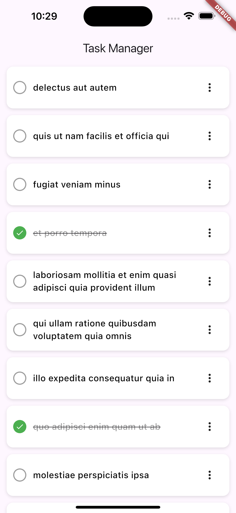
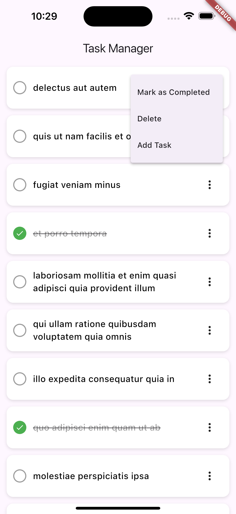
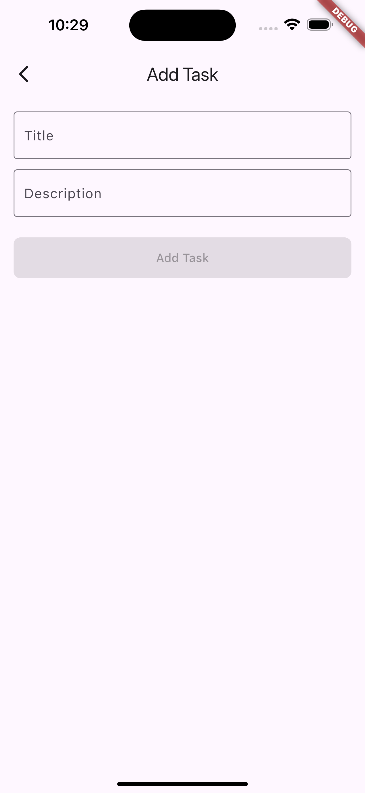
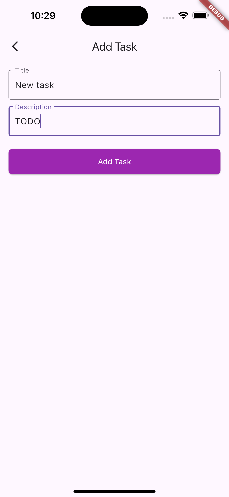

## 🚀 Getting Started

1. **Clone the repository:**
   ```bash
   git clone https://github.com/riyadmohammed/Task-Manager.giy
   cd Task-Manager

# Task Manager App

A simple task management Flutter application that allows users to add, view, complete, and delete
tasks.

## Features

- Add new tasks with a title and description
- Mark tasks as completed/uncompleted
- Delete tasks
- View all tasks in a list
- State management using Provider
- Clean and simple UI

## Architecture

- **MVVM pattern** with:
    - `Model`: Defines the task structure
    - `View`: Displays tasks and handles user interaction
    - `ViewModel`: Manages business logic and state

## Folder Structure

lib/
├── models/
│ └── task_model.dart
├── services/
│ └── task_service.dart
├── viewmodel/
│ └── task_viewmodel.dart
├── views/
│ ├── task_manager_page.dart
│ └── add_task_page.dart
├── main.dart

## 📸 Screenshots

### Main Page



### Task Options



### Add Task Page



### Add Task Page


